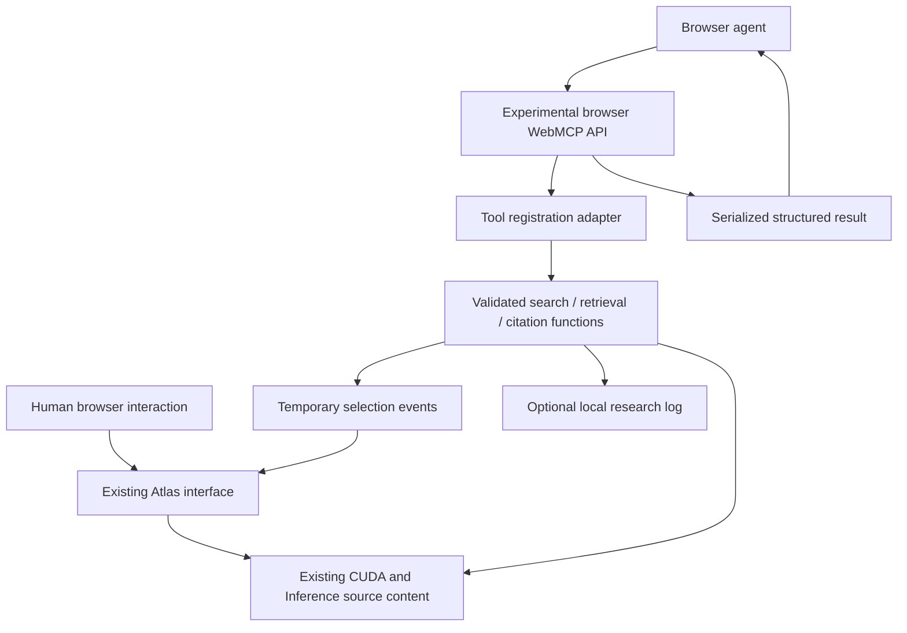

# WebMCP-Edge integration design

Status: local implementation and documentation for review; not pushed or deployed.
Date: 2026-10-06.
Specification reviewed: WebMCP Draft Community Group Report, 2 October 2026.

## Purpose and compatibility

An ordinary website does not automatically expose WebMCP tools. A site author must explicitly declare capabilities, through imperative JavaScript registration or the draft's supported declarative mechanisms. A browser implementing the relevant experimental API is also required. Deploying this adapter therefore changes the encyclopedia's shipped frontend, but does not make it compatible with every browser or every agent.

DOM-based agents can still interact with ordinary sites without WebMCP. This change adds an explicit capability interface alongside the existing human interface.

The adapter is application-specific JavaScript, not a browser extension, backend service, MCP server, or AI model. It connects registered browser tools to existing encyclopedia content functions. The static site contains the adapter code; the browser mediates registration and execution. An agent runtime supplies the agent, separately from the site.

## Sites and repository responsibilities

| Repository/site | Intended change | Current state |
| --- | --- | --- |
| `mailtotanvir/AI-Engineering-Visual-Guide` | Ship the frontend adapter, optional research panel, and Atlas selection/deep links | Implementation committed locally in an isolated checkout; not deployed |
| Proposed `WebMCP-Edge` research repository | Preserve protocol, integration patch, evidence, article source, and this design | Local repository; no public remote created |
| `mailtotanvir/mailtotanvir.github.io` | Track this design; later host/list the research article | This document only is staged locally; no live article or homepage change |

The blog does not need WebMCP to host the research article. The encyclopedia is the application under test. Adding this design document to the blog repository does not itself add WebMCP functionality to the blog.

## Architecture

No external AI API, database, server-side tool service, or remote telemetry is introduced.

## Actual implementation boundary

The local encyclopedia implementation is commit `1bf88d7`, based on `c8c5e2b6195e8f725f0ccba86b2b3d29c16514df`, branch `research/webmcp-edge`.

| File | Responsibility |
| --- | --- |
| `lib/webmcp/content.ts` | Derive canonical records from real CUDA/Inference Atlas exports; deterministic lexical search; retrieval; citation formatting |
| `lib/webmcp/tools.ts` | Three explicit input schemas, runtime validation, execution, and temporary selection/activity events |
| `lib/webmcp/register.ts` | Feature detection and asynchronous native registration, using a lifetime AbortSignal |
| `lib/webmcp/activity.ts` | Local selection/activity event definitions |
| `components/webmcp/ResearchPanel.tsx` | Mount registration, show native status, select local/native execution, inspect schemas/results, and export local logs |
| `components/webmcp/useAtlasSelection.ts` | Reveal selected entries in the mounted Atlas and honor entry query links on direct load |
| `components/shell/AppShell.tsx` | Mount the optional disclosure panel and registration lifecycle |
| CUDA/Inference Atlas browser components | Reflect tool-selected matches through existing domain and expansion state |
| `app/globals.css` | Minimal research-panel styling and matched-entry outlines |
| `tests/webmcp.test.ts` | Real-content and validation contracts; mocked registration/cancellation checks |
| `docs/webmcp-experiment.md` | Setup, behavior, trust, and implementation limitations |

The optional research disclosure currently sits below page content. Moving it into Settings would be a possible polish change; it is not part of the committed implementation.

## Tool contract

| Tool | Input | Output and effect |
| --- | --- | --- |
| `search_articles` | Nonempty query, up to 300 characters; optional integer limit 1–10, default 5 | Structured results from real Atlas content; highlights matches in the mounted Atlas |
| `get_article` | Existing namespaced ID | Full projected record, including summary and technical points; reveals it in the mounted Atlas |
| `cite_article` | Existing ID and APA/MLA/Chicago format | Deterministic bibliographic rendering from actual title/site/URL; does not navigate |

IDs are `cuda:atlas:<source-id>` and `inference:atlas:<source-id>`. Concept records are not separate journey-scene records; linked scenes remain metadata. No standalone scene indexing is included in this MVP.

Search splits normalized input on whitespace and sums substring matches: four points for title/domain matches and one for summary/technical-text matches, with stable ID ordering for ties. This is lexical OR-style matching, not semantic retrieval. No performance or relevance superiority is established.

Citation URLs point to the corresponding Atlas route with `?entry=<source-id>`. Missing author and date fields are not invented. APA uses `n.d.`; MLA omits unavailable dates; Chicago includes a missing-access-date note. Complete compliance with every bibliographic guide is not claimed.

Runtime validation rejects malformed objects, unknown fields, invalid limits/IDs, and unsupported formats. Tool errors propagate through the browser's execution mechanism rather than being represented as invented successful results.

## Browser/API behavior

Primary reference: https://webmachinelearning.github.io/webmcp/

The reviewed draft exposes secure-context `document.modelContext`. The implementation does not polyfill it and does not use a legacy `navigator.modelContext` fallback.

- Registration calls `registerTool(definition, {signal})` asynchronously.
- Aborting the lifetime signal unregisters tools. Partial registration failure aborts the shared lifetime.
- Callback execution receives its own cancellation signal, separate from registration lifetime.
- Native panel execution discovers a RegisteredTool object with `getTools()` and passes that object to `executeTool()`. The serialized JSON string is parsed for display.
- Local harness execution calls application functions directly and is labeled separately. It does not prove native browser interoperability or agent discovery.
- No additional cross-origin exposure is requested.

If the context is unavailable, the panel reports unavailable and normal site functionality is intended to continue. Registration failure is caught rather than crashing the shared shell. Actual browser lifecycle and regression behavior remain to be verified.

Browser implementation support may lag or differ from the draft. The draft is not a W3C Standard and is not on the W3C Standards Track.

## Human-visible and data effects

The encyclopedia's content, routes, and simulations remain the primary application. Tool calls may change temporary selection and domain expansion only in an already mounted Atlas. Cross-world matches appear as links in the structured result; tools do not automatically navigate to them.

Registration occurs independently of whether the panel is expanded. Activity recording occurs only while the research panel is open, keeps at most 100 calls in memory, and stores no remote telemetry. Closing the panel stops recording but retains the in-memory log until cleared or the page is destroyed. Export is an explicit local download. Inputs can contain personal text and must be reviewed before sharing.

Tools have no content writes or external effects, but selection highlights are state changes. The implementation therefore does not assert the draft's `readOnlyHint`, which describes no state modification.

## Security and trust

Tool declarations do not make a page trustworthy. Schemas and validation constrain inputs, not caller authority or agent intent. The page's descriptions and source content remain part of the agent's interaction surface. Results are displayed as text and derive from known source records. No secrets or external credentials are exposed.

Any future write operation would require a separate design for authorization, user consent, reversibility, and origin boundaries. It is outside this change.

## Validation and unresolved work

Completed locally: 218 tests across 13 suites, TypeScript checking, production export under `/AI-Engineering-Visual-Guide`, and patch applicability to the pinned base. Tests include six new WebMCP contracts. Dependencies were copied from the existing local checkout; clean network installation was not verified.

Not completed: ordinary-browser rendered checks, native WebMCP checks, DOM-versus-tool agent runs, root-path export checks, live deployment verification, and licensing resolution. Local server sockets were denied and Chromium failed to launch due to denied socket operations. Visiting a remote site avoids the local-server requirement but does not fix the denied browser process.

The current live encyclopedia has not received this change. A real live experiment requires first reviewing and deploying the adapter, then using an allowed browser environment with actual WebMCP support. No benchmark numbers have been generated.

## Rollout and rollback

1. Review the local encyclopedia commit, article draft, and evidence limitations.
2. Verify browser compatibility and ordinary navigation/visualization behavior in an environment that can launch browsers. Run the supplied smoke script and full manual matrix.
3. Resolve redistribution licensing before public research-package release.
4. Collect native and baseline agent runs if making comparison claims; otherwise publish an explicitly limited implementation note.
5. After user review, push the encyclopedia branch and deploy through its existing Pages process.
6. Verify the live subpath, deep links, unsupported-browser behavior, and native tool lifecycle.
7. Publish/list the final article and public reproducibility package with exact revision links.

Rollback: revert the integration commit and redeploy the prior static export. No backend state, database migration, or collected server telemetry needs rollback. This document can remain as the record of the experiment and its disposition.

## Tracking and document copies

Maintain identical copies at `docs/webmcp-design.md` in the research package and `docs/webmcp-design.md` in the blog repository. Update both when implementation behavior or rollout state changes. The research package preserves the implementation patch and manifest; the blog repository records the editorial/site relationship.

All current work is local. No push, publication, or live deployment is authorized by this documentation update beyond the user's existing instruction to review before publishing.
